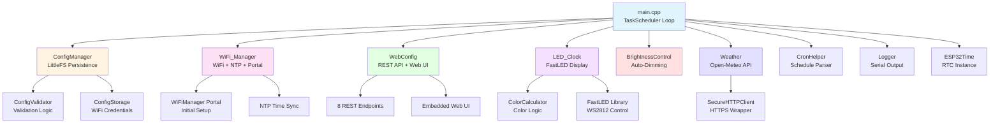

# Architecture Overview

This document provides a high-level overview of the 7-Segment LED Clock system architecture.

## System Components



## Component Descriptions

### Core System

**main.cpp**

- Entry point with Arduino `setup()` and `loop()`
- Initializes all subsystems in sequence
- Runs TaskScheduler for periodic task execution
- Monitors WiFi health and task scheduler stability
- Handles graceful restart requests

**ConfigManager**

- Loads/saves configuration from LittleFS filesystem
- Validates configuration using ConfigValidator
- Provides schema for web UI
- Manages palette definitions
- Persists 23 configuration fields

**Logger**

- Unified logging with timestamps
- Configurable log levels (DEBUG, INFO, WARN, ERROR, CRIT)
- Serial output with RTC-based timestamps
- Conditional debug output via `#define DEBUG`

### Network Layer

**WiFi_Manager**

- Connects to WiFi with saved credentials
- Manages WiFi reconnection with exponential backoff
- Syncs time via NTP (configurable timezone)
- Triggers WiFiManager portal on double-reset detection
- Handles WiFi recovery after connection loss

**WebConfig**

- Async web server on port 80
- 8 REST API endpoints (see [API.md](API.md))
- Embedded web UI (HTML/CSS/JavaScript)
- mDNS responder (`ledclock.local`)
- OTA firmware update support
- Geolocation detection via ipapi.co

### Display System

**LED_Clock**

- Controls 58 WS2812 RGB LEDs via FastLED
- 7-segment character mapping (digits, letters, symbols)
- Two color modes: SOLID and PALETTE
- Displays time, temperature, status messages, error codes
- Second indicator with configurable brightness difference

**ColorCalculator**

- Centralized color calculation logic
- Solid color rendering
- Palette-based color with per-character blending
- Indicator color calculation

**BrightnessControl**

- Automatic brightness dimming based on time schedule
- Smooth fade transitions (configurable duration)
- Separate brightness for main display and colon indicator
- Cached time parsing for performance

### External Services

**Weather**

- Fetches temperature from Open-Meteo API
- HTTPS requests via SecureHTTPClient
- Type-safe error handling with WeatherStatus enum
- Scheduled updates via cron expressions
- Temperature display integration

**SecureHTTPClient**

- Wrapper for WiFiClientSecure + HTTPClient
- Eliminates HTTP client setup duplication
- Standardized error handling
- Response struct with success/error details

### Utilities

**ConfigValidator**

- Centralized validation for all configuration fields
- Brightness validation (0-255)
- Color mode validation (0-2)
- Time string validation (HH:MM format)
- Full config validation with detailed error messages

**CronHelper**

- Cron expression parsing and evaluation
- Validates cron syntax (minute hour day month weekday)
- Determines if current time matches schedule
- Cached parsing for performance

**ConfigStorage**

- WiFi credentials persistence
- Separate from main configuration
- Used by WiFiManager portal

**CronHelper**

- Parses and evaluates cron expressions
- Validates schedule syntax
- Determines execution timing

## Data Flow

### Configuration Persistence

```
User Input (Web UI)
  → POST /api/config
  → ConfigValidator validates
  → ConfigManager saves to LittleFS
  → Some changes trigger restart
```

### Time Display

```
TaskScheduler (100ms interval)
  → updateClockCallback()
  → Check brightness schedule
  → Check temperature schedule
  → LED_Clock renders time
  → FastLED updates LEDs
```

### Weather Updates

```
Cron schedule triggers
  → Weather::fetchWeather()
  → SecureHTTPClient GET request
  → JSON parsing
  → Temperature stored
  → LED_Clock displays on schedule
```

### WiFi Recovery

```
WiFi connection lost
  → checkWiFiStatus() detects
  → Exponential backoff reconnection
  → Connection restored
  → NTP sync
  → mDNS restart
```

## Task Scheduling

The system uses TaskScheduler for periodic execution:

- **taskUpdateClock** (100ms) - Main display update loop
  - Updates brightness based on schedule
  - Checks if temperature should display
  - Checks if weather should update
  - Renders time or temperature to LEDs

Additional scheduled operations via cron:

- Weather temperature display (configurable, e.g., "0 * * * \*" = hourly)
- Weather API updates (configurable, e.g., "\*/30 * * * \*" = every 30 min)
- Clock updates (configurable via clockUpdateSchedule)

## Memory Architecture

**Flash Usage:** ~95% (1.24 MB of 1.31 MB)

- Firmware code
- Embedded web UI HTML/CSS/JavaScript
- Configuration schema JSON
- FastLED library
- WiFi/HTTP libraries

**RAM Usage:** ~15.7% (51 KB of 320 KB)

- Task scheduler state
- Configuration struct
- LED frame buffer (58 LEDs × 3 bytes)
- HTTP client buffers
- JSON parsing buffers (2-4 KB)

**LittleFS Filesystem:**

- `/config.json` - Main configuration (persistent)
- WiFiManager credentials (managed separately)

## Error Handling

**Display Error Codes:**

- `Er01` - WiFi connection failed
- `Er02` - Configuration initialization failed
- `Er03` - Weather API failed
- `Er04` - Invalid temperature unit
- `Er05` - WiFi disconnected during weather fetch

**System Recovery:**

- WiFi reconnection with exponential backoff
- Task scheduler health monitoring
- Automatic restart on critical failures
- Factory reset via double-reset detection

## Boot Sequence

1. Logger initialization
1. ConfigManager loads config from LittleFS
1. LED initialization (FastLED)
1. WiFi connection (or portal on double-reset)
1. NTP time synchronization
1. Web server startup + mDNS
1. Brightness control initialization
1. Initial weather fetch (if enabled)
1. Task scheduler starts

______________________________________________________________________

**Note:** This is a high-level overview. For detailed API documentation, see [API.md](API.md). For comprehensive code analysis, see [code-review/assessment-report-2025-12-28.md](code-review/assessment-report-2025-12-28.md).
